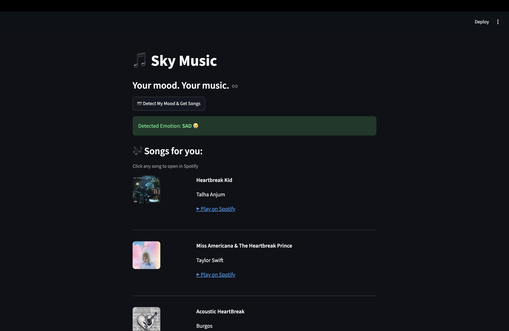

A SKY-Music 

An AI-powered web app that detects your facial emotion in real-time 
and recommends Spotify songs that match your mood.

-Real-time facial emotion detection using DeepFace
-Automatic Spotify song recommendations based on mood
-Clean web UI built with Streamlit
-Supports 7 emotions: Happy, Sad, Angry, Neutral, Fear, Surprise, Disgust

THE TECH STACK USED : - 

- Python
- OpenCV — webcam access
- DeepFace — emotion detection AI
- Spotify API — music recommendations
- Streamlit — web interface

📸 Demo :)

